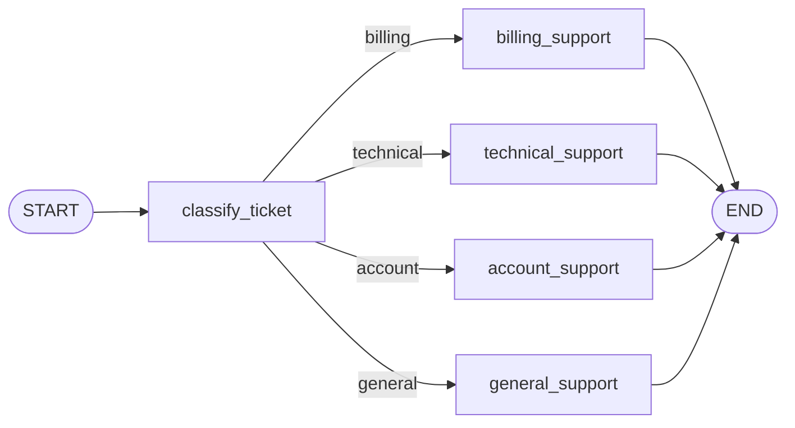

# LangGraph Support Chatbot

Educational support chatbot built with LangGraph, Ollama, and the local `qwen3:4b` model. It classifies each user message as `billing`, `technical`, `account`, or `general`, then routes the message to a specialized response node.

## Graph Flow



## Requirements

- Python 3.11+
- Ollama installed and running
- Local `qwen3:4b` model

## Installation

Run these commands from PowerShell at the project root:

```powershell
py -3.11 -m venv .venv
.\.venv\Scripts\python.exe -m pip install --upgrade pip
.\.venv\Scripts\python.exe -m pip install -r requirements.txt
ollama list
```

If `ollama list` does not show `qwen3:4b`, download the model:

```powershell
ollama pull qwen3:4b
```

## Run the Chatbot

CLI:

```powershell
.\.venv\Scripts\python.exe cli.py
```

Streamlit web chatbot:

```powershell
.\.venv\Scripts\streamlit.exe run app.py
```

Tests:

```powershell
.\.venv\Scripts\python.exe -m pytest -v
```

## What to Explain During the Demo

- `GraphState` is the shared state that moves through the graph: support message, category, answer, and trace.
- Each node reads state and returns only partial updates, such as `category`, `answer`, or new `trace` entries.
- `add_conditional_edges` decides whether execution continues through `billing_support`, `technical_support`, `account_support`, or `general_support`.
- `stream_mode="updates"` lets you observe each graph update step by step.
- The CLI and Streamlit chatbot reuse the same graph defined in `graph.py`; only the presentation layer changes.

## File Structure

- `graph.py`: defines `GraphState`, support nodes, and conditional edges.
- `llm.py`: adapts Ollama as the local text model using `qwen3:4b`.
- `runner.py`: runs the full graph or streams it step by step.
- `cli.py`: command-line chatbot for support messages.
- `app.py`: Streamlit chat interface with route visualization.
- `visualization.py`: generates the DOT diagram used by the web app.
- `tests/`: automated tests for the graph, runner, CLI, LLM, and visualization.

## Troubleshooting

If Ollama is unavailable, the CLI or Streamlit app will show an error explaining that `qwen3:4b` could not be used.

Check the following:

```powershell
ollama list
ollama serve
```

If the service is running but the model is missing:

```powershell
ollama pull qwen3:4b
```

Then run the CLI, web app, or tests again as needed.
