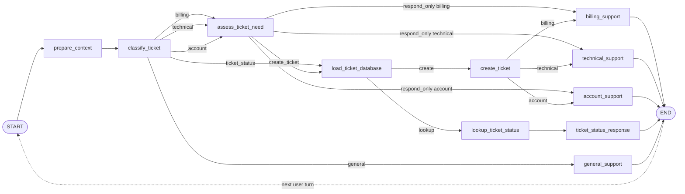

# LangGraph Support Intent Chatbot

A small, real-world LangGraph demo that behaves like a corporate support assistant. It uses Ollama with the local `qwen3:4b` model to classify user intent, route the conversation through a graph, and answer simple support-ticket status questions from a mock text database.

This project is designed for demos and team learning. It is intentionally small enough to explain in a meeting, but realistic enough to show why graph-based orchestration is useful.

## What It Demonstrates

- Conversation context preparation before routing.
- Intent classification: `billing`, `technical`, `account`, `ticket_status`, or `general`.
- Conditional graph routing with LangGraph.
- Conversation history across turns.
- Follow-up handling, such as sharing `TCK-1002` after the bot asks for a ticket ID.
- A mock ticket database stored in `data/mock_tickets.txt`.
- Ticket-creation logic for real support incidents, including queue and priority assignment.
- Cost-aware graph design: the ticket database is loaded only when the route needs it.
- A CLI and an interactive Streamlit web UI that show the same graph execution.

## Graph Flow



LangGraph runs once per user turn. The conversational loop happens in the CLI or web app: each new user message starts another graph run, and previous messages are passed into `conversation_history`.

The graph is intentionally cost-aware: it prepares context and classifies first, then loads the mock ticket database only when the selected route needs ticket data. That happens for `ticket_status` lookups and for real incidents where `assess_ticket_need` decides to create a support ticket. The ticket file loader is cached in-process, so repeated ticket-related turns do not reread the file from disk.

## Production-Like Behavior

The assistant follows a realistic support workflow:

1. `prepare_context` captures the current reason for contact and folds in recent conversation history.
2. `classify_ticket` determines the motive of the request.
3. `assess_ticket_need` decides whether the assistant can answer directly or must create a ticket.
4. `create_ticket` adds a mock ticket to the graph state with `status`, `queue`, `priority`, `reason`, and `summary`.
5. The specialist node advises the user and confirms the ticket details when a ticket was created.

This keeps the demo small while showing the same orchestration boundary a real system would use before writing to a ticketing platform.

## Example Conversation

```text
User: Can you check my ticket?
Bot: I can check that. Please share your ticket ID (for example, TCK-1002).

User: TCK-1002
Bot: TCK-1002 for Contoso is Waiting on Customer. Summary: Duplicate invoice charge. Owner: Billing. Last update: 2026-06-14.
```

This works because the second turn includes the previous messages in `conversation_history`, so the graph can understand that `TCK-1002` is a follow-up to a ticket-status request.

Ticket creation example:

```text
User: The app crashes when I export reports.
Bot: I created support ticket TCK-1004 in the technical_support_tier_2 queue with high priority. Please share the error message, environment, and reproduction steps.
```

The created ticket is a mock record added to the current graph state. The source text file remains the seed database for the demo, which keeps runs predictable while still showing where a real system would write to a database.

## Requirements

- Python 3.11+
- Ollama installed and running
- Local `qwen3:4b` model

## Installation

Run these commands from PowerShell at the project root:

```powershell
py -3.11 -m venv .venv
.\.venv\Scripts\python.exe -m pip install --upgrade pip
.\.venv\Scripts\python.exe -m pip install -r requirements.txt
ollama list
```

If `ollama list` does not show `qwen3:4b`, download the model:

```powershell
ollama pull qwen3:4b
```

## Run the Demo

CLI:

```powershell
.\.venv\Scripts\python.exe cli.py
```

Streamlit web chatbot:

```powershell
.\.venv\Scripts\streamlit.exe run app.py
```

Tests:

```powershell
.\.venv\Scripts\python.exe -m pytest -v
```

## What to Explain During the Demo

- `GraphState` is the shared state that moves through the graph: support message, conversation history, support reason, mock ticket database, ticket action, ticket ID, queue, priority, category, answer, and trace.
- Each node reads state and returns only partial updates, such as `category`, `answer`, or new `trace` entries.
- `add_conditional_edges` decides whether execution continues through a direct support answer, ticket lookup, or ticket creation.
- `prepare_context` turns the active conversation into a support reason before classification.
- `assess_ticket_need` determines whether a billing, technical, or account message needs a ticket or can be answered directly, then assigns queue and priority.
- `create_ticket` creates a mock `Open` ticket in graph state and routes the user to the right support specialist.
- `load_ticket_database` only runs for routes that need ticket data and uses a cached text-file loader.
- `lookup_ticket_status` searches the current message first, then previous conversation history, for IDs such as `TCK-1002`.
- `stream_mode="updates"` lets you observe each graph update step by step.
- The CLI and Streamlit chatbot reuse the same graph defined in `graph.py`; only the presentation layer changes.

## Why LangGraph Here

A simple chatbot can call an LLM directly, but this demo shows where a graph becomes useful:

- Different intents can take different paths.
- Expensive or unnecessary work can be avoided.
- Each step is visible and testable.
- Business logic, such as deciding whether to create a ticket or looking up ticket status, can be separated from LLM response generation.
- The UI can stream graph updates and show what the assistant is doing.

## File Structure

- `graph.py`: defines `GraphState`, support nodes, and conditional edges.
- `ticket_db.py`: parses and formats the mock ticket database.
- `data/mock_tickets.txt`: mock support tickets used by the ticket-status route.
- `llm.py`: adapts Ollama as the local text model using `qwen3:4b`.
- `runner.py`: runs the full graph or streams it step by step.
- `cli.py`: command-line chatbot for support messages.
- `app.py`: Streamlit chat interface with route visualization.
- `visualization.py`: generates the DOT diagram used by the web app.
- `tests/`: automated tests for the graph, runner, CLI, LLM, and visualization.

## Troubleshooting

If Ollama is unavailable, the CLI or Streamlit app will show an error explaining that `qwen3:4b` could not be used.

Check the following:

```powershell
ollama list
ollama serve
```

If the service is running but the model is missing:

```powershell
ollama pull qwen3:4b
```

Then run the CLI, web app, or tests again as needed.
