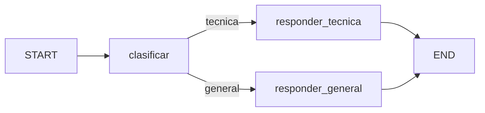

# LangGraph Ollama Demo Implementation Plan

> **For agentic workers:** REQUIRED SUB-SKILL: Use superpowers:subagent-driven-development (recommended) or superpowers:executing-plans to implement this plan task-by-task. Steps use checkbox (`- [ ]`) syntax for tracking.

**Goal:** Construir una demo educativa en Python con un grafo condicional de LangGraph, Ollama `qwen3:4b`, CLI interactiva y una interfaz Streamlit que muestre la estructura y ejecución del grafo.

**Architecture:** `graph.py` contendrá el estado y grafo independientes de la interfaz y recibirá un generador de texto inyectado. `llm.py` adaptará `ChatOllama` a esa interfaz. `runner.py` convertirá el stream de actualizaciones de LangGraph en eventos consumibles tanto por la CLI como por Streamlit.

**Tech Stack:** Python 3.11+, LangGraph 1.x, `langchain-ollama` 1.x, Streamlit 1.x, pytest.

---

## File Structure

- `graph.py`: esquema de estado, nodos, normalización, rutas y compilación.
- `llm.py`: adaptador de Ollama y errores legibles.
- `runner.py`: ejecución progresiva y acumulación del estado.
- `cli.py`: bucle interactivo de terminal.
- `visualization.py`: generación del diagrama Graphviz con nodos activos.
- `app.py`: interfaz web Streamlit.
- `tests/test_graph.py`: comportamiento y ramas del grafo.
- `tests/test_llm.py`: contrato del adaptador Ollama.
- `tests/test_runner.py`: eventos y estado acumulado.
- `tests/test_cli.py`: interacción de terminal.
- `tests/test_visualization.py`: resaltado del diagrama.
- `requirements.txt`: dependencias de ejecución y pruebas.
- `.gitignore`: artefactos locales de Python y Streamlit.
- `README.md`: guía de demo, instalación, explicación y comandos.

### Task 1: Project Dependencies

**Files:**
- Create: `requirements.txt`
- Create: `.gitignore`

- [ ] **Step 1: Declare dependencies**

```text
langgraph>=1.0,<2.0
langchain-ollama>=1.0,<2.0
streamlit>=1.54,<2.0
pytest>=9.0,<10.0
```

- [ ] **Step 2: Ignore generated files**

```gitignore
__pycache__/
*.py[cod]
.pytest_cache/
.venv/
venv/
.streamlit/
```

- [ ] **Step 3: Create a virtual environment and install**

Run:

```powershell
python -m venv .venv
.\.venv\Scripts\python.exe -m pip install --upgrade pip
.\.venv\Scripts\python.exe -m pip install -r requirements.txt
```

Expected: all packages install with exit code `0`.

- [ ] **Step 4: Commit**

```powershell
git add requirements.txt .gitignore
git commit -m "build: add Python demo dependencies"
```

### Task 2: Conditional LangGraph Core

**Files:**
- Create: `tests/test_graph.py`
- Create: `graph.py`

- [ ] **Step 1: Write failing graph tests**

```python
from graph import build_graph, normalize_category


class FakeModel:
    def __init__(self, responses: list[str]):
        self.responses = iter(responses)
        self.prompts: list[str] = []

    def generate(self, prompt: str) -> str:
        self.prompts.append(prompt)
        return next(self.responses)


def test_routes_technical_question_to_technical_node():
    model = FakeModel(["tecnica", "Usa un StateGraph."])
    graph = build_graph(model)

    result = graph.invoke({"question": "¿Cómo funciona LangGraph?", "trace": []})

    assert result["category"] == "tecnica"
    assert result["answer"] == "Usa un StateGraph."
    assert result["trace"] == [
        "clasificar: categoria=tecnica",
        "responder_tecnica: respuesta generada",
    ]
    assert len(model.prompts) == 2
    assert "especialista tecnico" in model.prompts[1].lower()


def test_routes_general_question_to_general_node():
    model = FakeModel(["general", "Es una buena pregunta."])
    graph = build_graph(model)

    result = graph.invoke({"question": "¿Cómo estás?", "trace": []})

    assert result["category"] == "general"
    assert result["trace"][-1] == "responder_general: respuesta generada"
    assert "asistente general" in model.prompts[1].lower()


def test_unknown_classification_falls_back_to_general():
    assert normalize_category("No estoy seguro") == "general"


def test_normalizes_case_and_extra_text():
    assert normalize_category("TECNICA\n") == "tecnica"
```

- [ ] **Step 2: Run tests and verify RED**

Run:

```powershell
.\.venv\Scripts\python.exe -m pytest tests/test_graph.py -v
```

Expected: collection fails because `graph` does not exist.

- [ ] **Step 3: Implement the minimal graph**

```python
import operator
from typing import Annotated, Literal, Protocol

from langgraph.graph import END, START, StateGraph
from typing_extensions import TypedDict


Category = Literal["tecnica", "general"]


class TextModel(Protocol):
    def generate(self, prompt: str) -> str: ...


class GraphState(TypedDict, total=False):
    question: str
    category: Category
    answer: str
    trace: Annotated[list[str], operator.add]


def normalize_category(raw: str) -> Category:
    normalized = raw.strip().lower()
    return "tecnica" if normalized == "tecnica" else "general"


def build_graph(model: TextModel):
    def classify(state: GraphState) -> GraphState:
        prompt = (
            "Clasifica la pregunta como tecnica o general. "
            "Responde solamente una palabra: tecnica o general.\n"
            f"Pregunta: {state['question']}\n/no_think"
        )
        category = normalize_category(model.generate(prompt))
        return {
            "category": category,
            "trace": [f"clasificar: categoria={category}"],
        }

    def answer_technical(state: GraphState) -> GraphState:
        prompt = (
            "Eres un especialista tecnico. Responde de forma clara y breve.\n"
            f"Pregunta: {state['question']}\n/no_think"
        )
        return {
            "answer": model.generate(prompt).strip(),
            "trace": ["responder_tecnica: respuesta generada"],
        }

    def answer_general(state: GraphState) -> GraphState:
        prompt = (
            "Eres un asistente general. Responde de forma clara y breve.\n"
            f"Pregunta: {state['question']}\n/no_think"
        )
        return {
            "answer": model.generate(prompt).strip(),
            "trace": ["responder_general: respuesta generada"],
        }

    def route(state: GraphState) -> Category:
        return state["category"]

    builder = StateGraph(GraphState)
    builder.add_node("clasificar", classify)
    builder.add_node("responder_tecnica", answer_technical)
    builder.add_node("responder_general", answer_general)
    builder.add_edge(START, "clasificar")
    builder.add_conditional_edges(
        "clasificar",
        route,
        {
            "tecnica": "responder_tecnica",
            "general": "responder_general",
        },
    )
    builder.add_edge("responder_tecnica", END)
    builder.add_edge("responder_general", END)
    return builder.compile()
```

- [ ] **Step 4: Run tests and verify GREEN**

Run:

```powershell
.\.venv\Scripts\python.exe -m pytest tests/test_graph.py -v
```

Expected: `4 passed`.

- [ ] **Step 5: Commit**

```powershell
git add graph.py tests/test_graph.py
git commit -m "feat: add conditional LangGraph workflow"
```

### Task 3: Ollama Adapter

**Files:**
- Create: `tests/test_llm.py`
- Create: `llm.py`

- [ ] **Step 1: Write failing adapter tests**

```python
import pytest

from llm import OllamaTextModel, OllamaUnavailableError


class Response:
    content = "respuesta local"


class FakeClient:
    def invoke(self, prompt: str):
        assert prompt == "hola"
        return Response()


class BrokenClient:
    def invoke(self, prompt: str):
        raise ConnectionError("connection refused")


def test_returns_message_content_as_text():
    model = OllamaTextModel(client=FakeClient())
    assert model.generate("hola") == "respuesta local"


def test_translates_connection_errors():
    model = OllamaTextModel(client=BrokenClient())

    with pytest.raises(OllamaUnavailableError, match="qwen3:4b"):
        model.generate("hola")
```

- [ ] **Step 2: Run tests and verify RED**

Run:

```powershell
.\.venv\Scripts\python.exe -m pytest tests/test_llm.py -v
```

Expected: collection fails because `llm` does not exist.

- [ ] **Step 3: Implement the adapter**

```python
from typing import Any

from langchain_ollama import ChatOllama


MODEL_NAME = "qwen3:4b"


class OllamaUnavailableError(RuntimeError):
    pass


class OllamaTextModel:
    def __init__(self, client: Any | None = None):
        self.client = client or ChatOllama(model=MODEL_NAME, temperature=0)

    def generate(self, prompt: str) -> str:
        try:
            response = self.client.invoke(prompt)
        except Exception as exc:
            raise OllamaUnavailableError(
                "No se pudo consultar Ollama. Verifica que el servicio este "
                f"activo y que el modelo {MODEL_NAME} este instalado."
            ) from exc
        return str(response.content)
```

- [ ] **Step 4: Run tests and verify GREEN**

Run:

```powershell
.\.venv\Scripts\python.exe -m pytest tests/test_llm.py -v
```

Expected: `2 passed`.

- [ ] **Step 5: Commit**

```powershell
git add llm.py tests/test_llm.py
git commit -m "feat: connect graph to local Ollama model"
```

### Task 4: Streamed Execution Events

**Files:**
- Create: `tests/test_runner.py`
- Create: `runner.py`

- [ ] **Step 1: Write failing runner tests**

```python
from graph import build_graph
from runner import run_graph, stream_graph


class FakeModel:
    def __init__(self):
        self.responses = iter(["tecnica", "Respuesta"])

    def generate(self, prompt: str) -> str:
        return next(self.responses)


def test_stream_exposes_each_executed_node_and_accumulated_state():
    events = list(stream_graph(build_graph(FakeModel()), "Explica Python"))

    assert [event.node for event in events] == [
        "clasificar",
        "responder_tecnica",
    ]
    assert events[0].state["category"] == "tecnica"
    assert events[-1].state["answer"] == "Respuesta"
    assert len(events[-1].state["trace"]) == 2


def test_run_graph_returns_final_state():
    result = run_graph(build_graph(FakeModel()), "Explica Python")
    assert result["answer"] == "Respuesta"
```

- [ ] **Step 2: Run tests and verify RED**

Run:

```powershell
.\.venv\Scripts\python.exe -m pytest tests/test_runner.py -v
```

Expected: collection fails because `runner` does not exist.

- [ ] **Step 3: Implement streamed state accumulation**

```python
from dataclasses import dataclass
from typing import Any, Iterator

from graph import GraphState


@dataclass(frozen=True)
class StepEvent:
    node: str
    update: GraphState
    state: GraphState


def stream_graph(graph: Any, question: str) -> Iterator[StepEvent]:
    state: GraphState = {"question": question, "trace": []}
    for chunk in graph.stream(state, stream_mode="updates"):
        for node, update in chunk.items():
            merged = dict(state)
            for key, value in update.items():
                if key == "trace":
                    merged["trace"] = [*state.get("trace", []), *value]
                else:
                    merged[key] = value
            state = merged
            yield StepEvent(node=node, update=update, state=dict(state))


def run_graph(graph: Any, question: str) -> GraphState:
    final_state: GraphState = {"question": question, "trace": []}
    for event in stream_graph(graph, question):
        final_state = event.state
    return final_state
```

- [ ] **Step 4: Run tests and verify GREEN**

Run:

```powershell
.\.venv\Scripts\python.exe -m pytest tests/test_runner.py -v
```

Expected: `2 passed`.

- [ ] **Step 5: Commit**

```powershell
git add runner.py tests/test_runner.py
git commit -m "feat: expose graph execution events"
```

### Task 5: Interactive CLI

**Files:**
- Create: `tests/test_cli.py`
- Create: `cli.py`

- [ ] **Step 1: Write failing CLI test**

```python
from cli import run_cli
from graph import build_graph


class FakeModel:
    def __init__(self):
        self.responses = iter(["general", "Hola desde el grafo"])

    def generate(self, prompt: str) -> str:
        return next(self.responses)


def test_cli_processes_question_and_exits():
    answers = iter(["Hola", "salir"])
    output: list[str] = []

    run_cli(
        build_graph(FakeModel()),
        input_fn=lambda _: next(answers),
        output_fn=output.append,
    )

    rendered = "\n".join(output)
    assert "clasificar -> responder_general" in rendered
    assert "Hola desde el grafo" in rendered
```

- [ ] **Step 2: Run test and verify RED**

Run:

```powershell
.\.venv\Scripts\python.exe -m pytest tests/test_cli.py -v
```

Expected: collection fails because `cli` does not exist.

- [ ] **Step 3: Implement the CLI**

```python
from collections.abc import Callable
from typing import Any

from graph import build_graph
from llm import OllamaTextModel, OllamaUnavailableError
from runner import stream_graph


def run_cli(
    graph: Any,
    input_fn: Callable[[str], str] = input,
    output_fn: Callable[[str], None] = print,
) -> None:
    output_fn("Demo LangGraph + Ollama. Escribe 'salir' para terminar.")
    while True:
        question = input_fn("\nPregunta: ").strip()
        if not question or question.lower() in {"salir", "exit"}:
            return
        try:
            events = list(stream_graph(graph, question))
            final = events[-1].state
            route = " -> ".join(event.node for event in events)
            output_fn(f"Ruta: {route}")
            output_fn(f"Categoria: {final['category']}")
            output_fn(f"Respuesta: {final['answer']}")
        except OllamaUnavailableError as exc:
            output_fn(f"Error: {exc}")


def main() -> None:
    run_cli(build_graph(OllamaTextModel()))


if __name__ == "__main__":
    main()
```

- [ ] **Step 4: Run test and verify GREEN**

Run:

```powershell
.\.venv\Scripts\python.exe -m pytest tests/test_cli.py -v
```

Expected: `1 passed`.

- [ ] **Step 5: Commit**

```powershell
git add cli.py tests/test_cli.py
git commit -m "feat: add interactive graph CLI"
```

### Task 6: Graph Visualization and Streamlit UI

**Files:**
- Create: `tests/test_visualization.py`
- Create: `visualization.py`
- Create: `app.py`

- [ ] **Step 1: Write failing visualization tests**

```python
from visualization import graph_dot


def test_graph_contains_both_conditional_routes():
    dot = graph_dot([])
    assert '"clasificar" -> "responder_tecnica"' in dot
    assert '"clasificar" -> "responder_general"' in dot


def test_executed_node_is_highlighted():
    dot = graph_dot(["clasificar"])
    assert '"clasificar" [label="clasificar", fillcolor="#22c55e"' in dot
```

- [ ] **Step 2: Run tests and verify RED**

Run:

```powershell
.\.venv\Scripts\python.exe -m pytest tests/test_visualization.py -v
```

Expected: collection fails because `visualization` does not exist.

- [ ] **Step 3: Implement Graphviz generation**

```python
def graph_dot(executed: list[str]) -> str:
    active = set(executed)

    def node(name: str, label: str) -> str:
        color = "#22c55e" if name in active else "#dbeafe"
        return (
            f'  "{name}" [label="{label}", fillcolor="{color}", '
            'style="filled,rounded", shape=box];'
        )

    return "\n".join(
        [
            "digraph LangGraphDemo {",
            '  rankdir="LR";',
            '  graph [bgcolor="transparent"];',
            node("START", "START"),
            node("clasificar", "clasificar"),
            node("responder_tecnica", "respuesta tecnica"),
            node("responder_general", "respuesta general"),
            node("END", "END"),
            '  "START" -> "clasificar";',
            '  "clasificar" -> "responder_tecnica" [label=" tecnica"];',
            '  "clasificar" -> "responder_general" [label=" general"];',
            '  "responder_tecnica" -> "END";',
            '  "responder_general" -> "END";',
            "}",
        ]
    )
```

- [ ] **Step 4: Run visualization tests and verify GREEN**

Run:

```powershell
.\.venv\Scripts\python.exe -m pytest tests/test_visualization.py -v
```

Expected: `2 passed`.

- [ ] **Step 5: Implement the Streamlit application**

```python
import streamlit as st

from graph import build_graph
from llm import OllamaTextModel, OllamaUnavailableError
from runner import stream_graph
from visualization import graph_dot


st.set_page_config(page_title="LangGraph + Ollama", page_icon="🔀", layout="wide")
st.title("LangGraph + Ollama")
st.caption("Demo de estado, nodos, aristas y enrutamiento condicional.")

if "executed" not in st.session_state:
    st.session_state.executed = []
if "result" not in st.session_state:
    st.session_state.result = None

left, right = st.columns([1, 1])

with left:
    st.subheader("Estructura del grafo")
    graph_placeholder = st.empty()
    graph_placeholder.graphviz_chart(
        graph_dot(st.session_state.executed),
        use_container_width=True,
    )
    st.info(
        "El nodo clasificar modifica el estado. La arista condicional elige "
        "una de las dos ramas."
    )

with right:
    st.subheader("Ejecutar una pregunta")
    with st.form("question_form"):
        question = st.text_input(
            "Pregunta",
            placeholder="Ejemplo: ¿Cómo funciona una API REST?",
        )
        submitted = st.form_submit_button("Ejecutar grafo", type="primary")

    if submitted:
        if not question.strip():
            st.warning("Escribe una pregunta antes de ejecutar el grafo.")
        else:
            st.session_state.executed = []
            st.session_state.result = None
            try:
                graph = build_graph(OllamaTextModel())
                with st.status("Ejecutando nodos...", expanded=True) as status:
                    for event in stream_graph(graph, question.strip()):
                        st.session_state.executed.append(event.node)
                        graph_placeholder.graphviz_chart(
                            graph_dot(st.session_state.executed),
                            use_container_width=True,
                        )
                        status.write(
                            f"**{event.node}** actualizo: `{event.update}`"
                        )
                        st.session_state.result = event.state
                    status.update(label="Grafo completado", state="complete")
            except OllamaUnavailableError as exc:
                st.error(str(exc))

    if st.session_state.result:
        result = st.session_state.result
        st.success(result["answer"])
        metric_a, metric_b = st.columns(2)
        metric_a.metric("Categoria", result["category"])
        metric_b.metric("Nodos ejecutados", len(st.session_state.executed))
        st.write("**Ruta:** " + " → ".join(st.session_state.executed))
        with st.expander("Estado final del grafo"):
            st.json(result)

st.divider()
st.markdown(
    """
**Conceptos de la demo**

- **Estado:** datos compartidos entre nodos.
- **Nodo:** función que lee el estado y devuelve cambios.
- **Arista condicional:** decide el siguiente nodo usando el estado.
- **Stream:** permite observar cada actualización durante la ejecución.
"""
)
```

- [ ] **Step 6: Validate imports and syntax**

Run:

```powershell
.\.venv\Scripts\python.exe -m py_compile app.py visualization.py
.\.venv\Scripts\python.exe -m pytest tests/test_visualization.py -v
```

Expected: both commands exit `0`.

- [ ] **Step 7: Commit**

```powershell
git add app.py visualization.py tests/test_visualization.py
git commit -m "feat: add interactive Streamlit graph view"
```

### Task 7: Documentation and End-to-End Verification

**Files:**
- Create: `README.md`
- Modify: files found by verification only when a failing check requires it.

- [ ] **Step 1: Write the README**

The README must contain:

```markdown
# LangGraph + Ollama Demo

Demo educativa de un grafo condicional con dos interfaces: CLI y Streamlit.

## Grafo



## Requisitos

- Python 3.11 o superior
- Ollama en ejecución
- Modelo local `qwen3:4b`

## Instalación en PowerShell

```powershell
python -m venv .venv
.\.venv\Scripts\python.exe -m pip install -r requirements.txt
ollama list
```

Si el modelo no aparece:

```powershell
ollama pull qwen3:4b
```

## Ejecutar la CLI

```powershell
.\.venv\Scripts\python.exe cli.py
```

## Ejecutar la interfaz web

```powershell
.\.venv\Scripts\streamlit.exe run app.py
```

## Ejecutar las pruebas

```powershell
.\.venv\Scripts\python.exe -m pytest -v
```

## Qué explicar durante la demo

1. `GraphState` representa el estado compartido.
2. Cada nodo devuelve solo los campos que modifica.
3. `add_conditional_edges` elige una rama usando `category`.
4. `stream_mode="updates"` expone cada cambio mientras el grafo avanza.
5. La CLI y la web reutilizan el mismo grafo compilado.
```

- [ ] **Step 2: Run the complete automated suite**

Run:

```powershell
.\.venv\Scripts\python.exe -m pytest -v
.\.venv\Scripts\python.exe -m py_compile graph.py llm.py runner.py cli.py visualization.py app.py
```

Expected: all tests pass and compilation exits `0`.

- [ ] **Step 3: Verify local Ollama and the installed model**

Run:

```powershell
ollama list
```

Expected: output includes `qwen3:4b`.

- [ ] **Step 4: Smoke-test a real graph execution**

Run:

```powershell
@'
from graph import build_graph
from llm import OllamaTextModel
from runner import run_graph

result = run_graph(
    build_graph(OllamaTextModel()),
    "¿Qué diferencia hay entre una lista y una tupla en Python?",
)
print(result)
'@ | .\.venv\Scripts\python.exe -
```

Expected: `category` is `tecnica`, the trace contains two entries, and
`answer` contains non-empty text.

- [ ] **Step 5: Start Streamlit and verify the HTTP endpoint**

Run in one PowerShell window:

```powershell
.\.venv\Scripts\streamlit.exe run app.py --server.headless true
```

Run in another:

```powershell
Invoke-WebRequest http://localhost:8501 -UseBasicParsing
```

Expected: HTTP status `200`. Open the local app and execute one technical and
one general question; verify that the highlighted branch changes.

- [ ] **Step 6: Check repository state and commit**

Run:

```powershell
git status --short
git diff --check
```

Expected: only intended files are present and `git diff --check` has no
output.

```powershell
git add README.md
git commit -m "docs: add demo setup and presentation guide"
```
